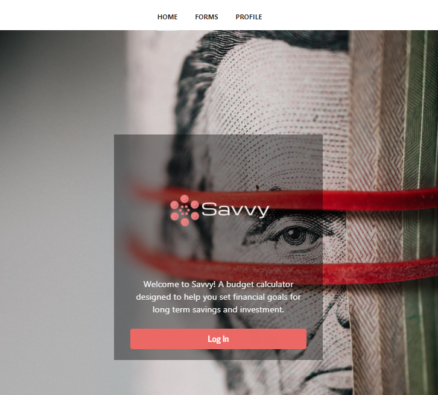
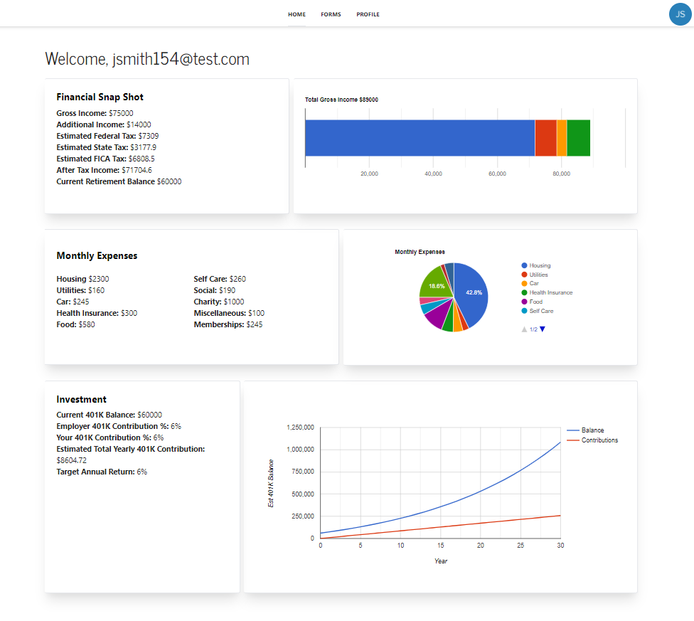

# Savvy Budget


## Description
A financial application designed to help users set financial goals for long term savings and investment.

## Table of Contents
* [User Story](#user-story)
* [Links](#links)
* [Images](#images) 
* [Installation](#installation)
* [Authentication](#authentication)
* [Technologies](#technologies)  
* [License](#license)
* [Contributors](#contributors)

## User Story
As a person new to finances, budgeting, and investing, I want a dashboard where I can visualize personalized financial information. I want to estimate my state, federal, and fica taxes based on my gross income. I also want to receive budget and investing information so that I may to set financial goals for long term savings and investment. I want to do this so I can feel financially confident about my future.

## Links
Published URL: [https://savvybudget.herokuapp.com/](https://savvybudget.herokuapp.com/)

Repository: [https://github.com/Jason-Jorgensen/Budget-App](https://github.com/Jason-Jorgensen/Budget-App)


## Images
The following image shows the application login:
<br>

<br>
The following image shows the application profile:
<br>

<br>

## Installation
To install necessary dependencies, run the following command:
  ```
  npm install
  ```
This application requires the following dependencies:
  ```
  npm i axios
  npm i mongoose
  npm i react-router-dom
  npm i tailwindcss@latest postcss@latest autoprefixer@latest
  npm i react-google-charts
  npm i react reveal
  ```
Create the following files with the contents:
  ```
  .env
      - DB_USERNAME
      - DB_PASSWORD      
  .gitignore
      - node_modules/
      - .env
  ```

## Authentication
This app is set up to use Auth0 as an authentication provider. Follow these [Auth0 integration steps](https://hasura.io/docs/latest/graphql/core/guides/integrations/auth0-jwt.html). You'll need to set the appropriate environment variables inside the client:
  ```
  .env
      - REACT_APP_AUTH0_DOMAIN
      - REACT_APP_AUTH0_CLIENTID
  ```

## Technologies
 * JavaScript
 * [Tailwind.css](https://tailwindcss.com/docs)
 * [Node.js](https://nodejs.org/en/docs/)
 * [npm](https://www.npmjs.com/)
 * [Express](https://expressjs.com/)
 * [MongoDB](https://docs.mongodb.com/)
 * [Mongoose](https://mongoosejs.com/docs/)
 * [Heroku](https://devcenter.heroku.com/categories/reference)
 * [React.js](https://reactjs.org/docs/getting-started.html)
 * [Auth0](https://auth0.com/docs/)
 * [React Google Charts](https://react-google-charts.com/)

## License
This project is licensed under the MIT license.

## Contributors
[Matthew Petersen](https://github.com/MVPeter)
<br>
[Jason Jorgensen](https://github.com/Jason-Jorgensen)
<br>
[Spencer Creer](https://github.com/spencercreer/)
